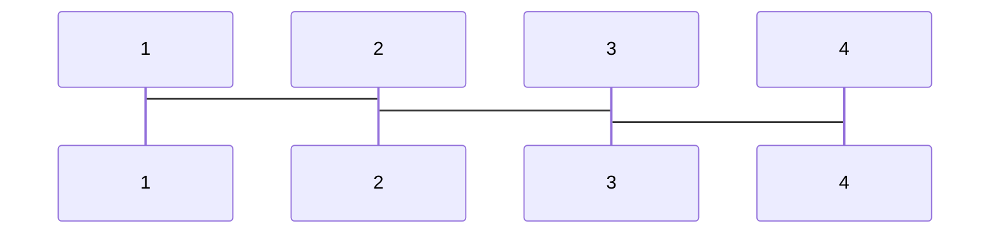
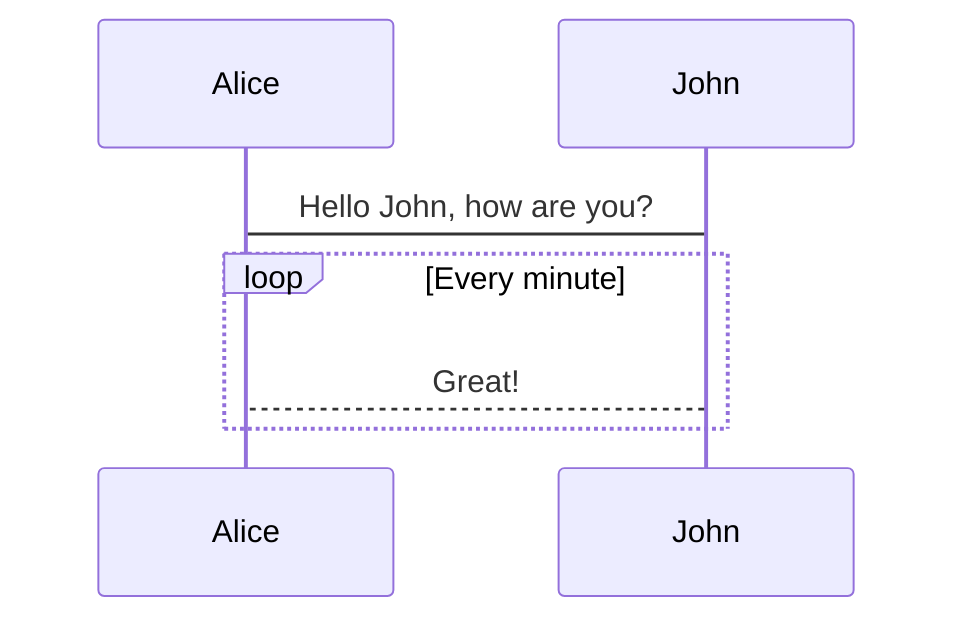

## Getting Mermaid to run

import MermaidLoader from "../../utils/MermaidLoader";

<MermaidLoader client:load />

This is a test post for the mermaid markdown plugin. Adding the following mermaid graph:

```
graph TD;
    A-->B;
    A-->C;
    B-->D;
    C-->D;
```

This doesn't compile when adding the remark plugin `mdx-mermaid` to `astro.config.mjs`. (Worked in Docusaurus 2.0)

```javascript
export default defineConfig({
	integrations: [
		mdx({
			remarkPlugins: [Mermaid],
		}),
	],
});
```

and

```javascript
export default defineConfig({
	markdown: {
		remarkPlugins: [Mermaid],
	},
});
```

both convert the codeblock to a react component, leaving a plain text `import { Mermaid } from 'mdx-mermaid/lib/Mermaid';`.

The astro mdx compiler needs to run again over the code or, in other terms, we need to run the mermaid plugin earlier.

None of the packages seem to work fully or require playwright to render svg.

All the blocks using the shiki syntax highlighter have no language indication. Switching over to `prism` in our `astro.config.mjs` (property: `markdown.syntaxHighlight`) we get `language-mermaid` classes:

```html
<pre class="language-mermaid">
    <code class="language-mermaid">
        <span class="token keyword">graph</span> TD<span class="token punctuation">;</span>
        A<span class="token arrow operator">--&gt;</span>B<span class="token punctuation">;</span>
        A<span class="token arrow operator">--&gt;</span>C<span class="token punctuation">;</span>
        B<span class="token arrow operator">--&gt;</span>D<span class="token punctuation">;</span>
        C<span class="token arrow operator">--&gt;</span>D<span class="token punctuation">;</span>
    </code>
</pre>
```

Simply adding javascript to the client won't work with astro. We need a client component for that. Let's just create a React component, that renders naught and initializes the mermaid graphs.

```javascript
import { useEffect } from "react";
import mermaid from "mermaid";

export default () => {
	useEffect(() => {
		// load up mermaid without looking for code blocks
		mermaid.initialize({ startOnLoad: false });

		// remove newlines so mermaid doesn't throw errors
		document.querySelectorAll("pre.language-mermaid").forEach((block) => {
			block.innerHTML = block.innerHTML.replace(/\n/g, "");
		});

		// render the graphs
		mermaid.run({
			querySelector: "pre.language-mermaid",
		});
	}, []);
	return <></>;
};
```

Now we finally get our output:


## What I actually wanted to display

was grid lines. But that doesn't even work:



At least now we can display fancy flow graphs:



Now John is stuck in a great loop.
